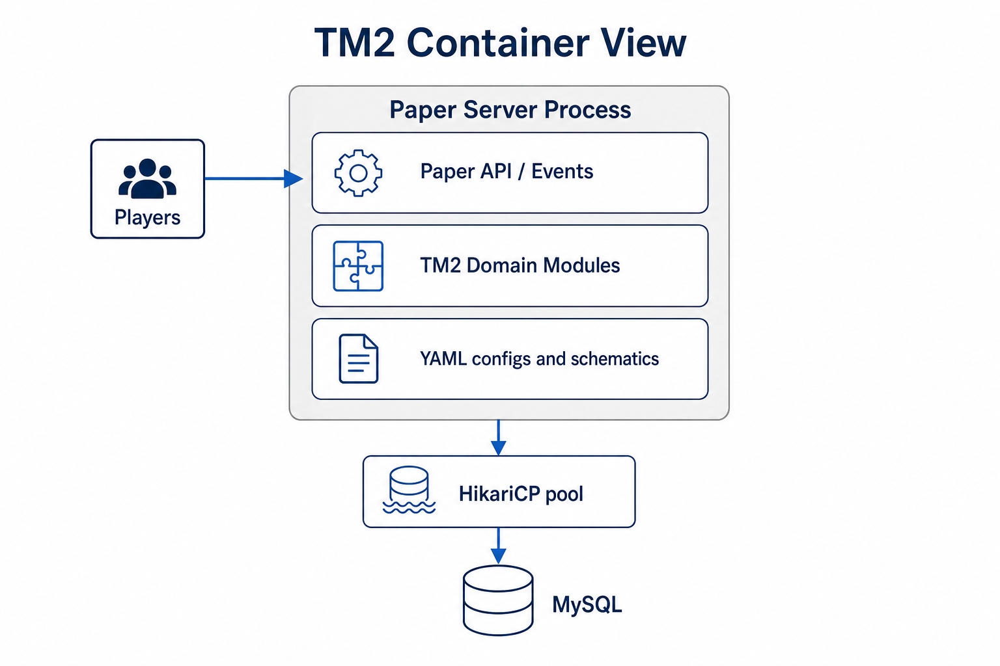

# TM2 Architecture

Architecture showcase for a **modular multiplayer software platform**.

> **Docs and diagrams only — no source code.**

TM2 is a domain-driven multiplayer system hosted on a real-time game-server runtime (Paper). The runtime is infrastructure. The engineering problem is designing a maintainable platform with progression, economy, territory, production, and combat subsystems.

## Contents

| Doc | Purpose |
|-----|---------|
| [Design Principles](docs/design-principles.md) | How decisions are made |
| [C4 Context](docs/c4-context.md) | System in its environment |
| [C4 Container](docs/c4-container.md) | Major runtime pieces |
| [Module Map](docs/module-map.md) | Domain decomposition |
| [ER Overview](docs/er-overview.md) | Persistence sketch |
| [ADRs](docs/adr/README.md) | Architecture Decision Records |
| [Testing approach](docs/testing-approach.md) | How domain logic is tested |
| [Tech stack](docs/tech-stack.md) | Technologies and roles |
| [Future Roadmap](docs/roadmap.md) | Planned evolution |
| [UI concepts](docs/ui-concepts.md) | Illustrative interface mockups |

## Why this repository exists

So an interviewer or collaborator can evaluate system design without access to a private codebase:

- module boundaries
- layering (command → service → repository → DB)
- progression and economy modeling
- testing philosophy for domain rules

## Quick view

### System context


### Containers



### Modules


## Architectural style

```
Command / Listener  →  Service  →  Repository  →  Database
```

| Principle | Appearance in TM2 |
|-----------|-------------------|
| Separation of concerns | Domain packages (`town`, `building`, `economy`, …) |
| Layering | Commands do not own SQL |
| Config-driven content | Buildings / production / reputation gates in YAML |
| Testability | JUnit + Mockito; pure rules without a live server |
| Design-first | Progression milestones documented before UI growth |

## Related public work

- [TeamPlayPlugin](https://github.com/legendery7/TeamPlayPlugin) — earlier team-mechanics module
- [corecraft](https://github.com/legendery7/corecraft) — product website
- [ITPPR](https://github.com/legendery7/ITPPR) — competency assessment web system

## License

Documentation © Mikhail Alekseev. All rights reserved.  
No license to the private implementation is granted.
