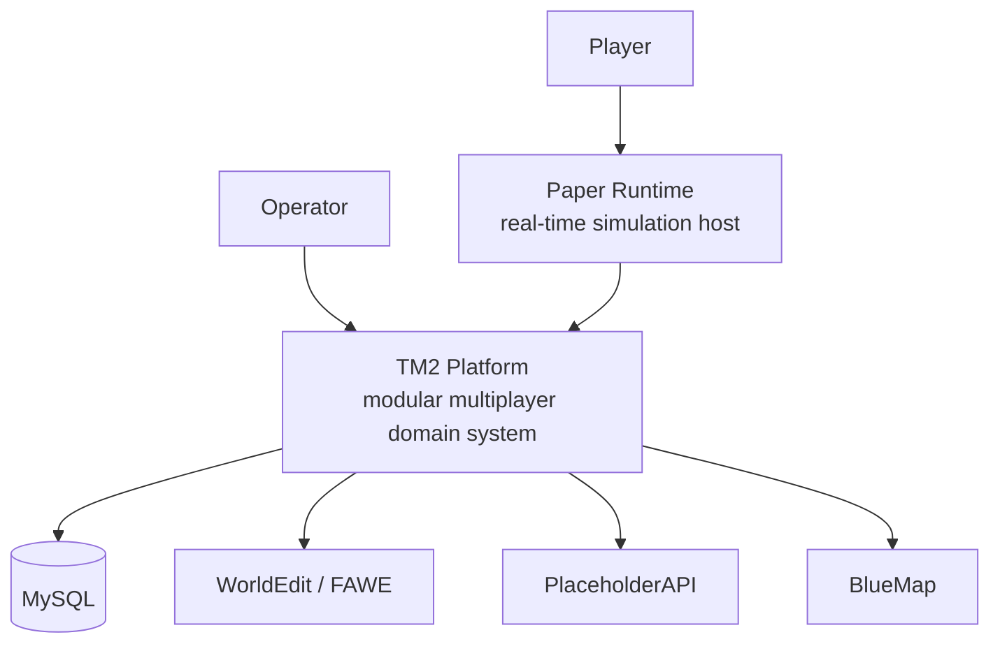
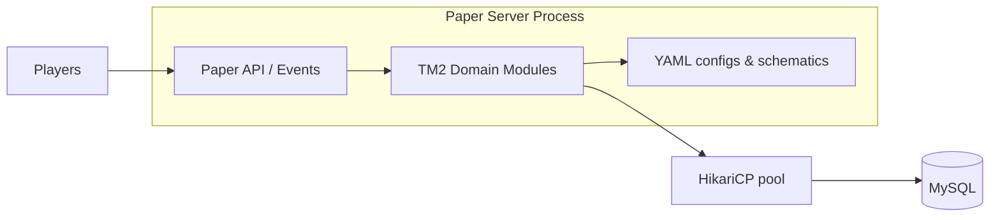
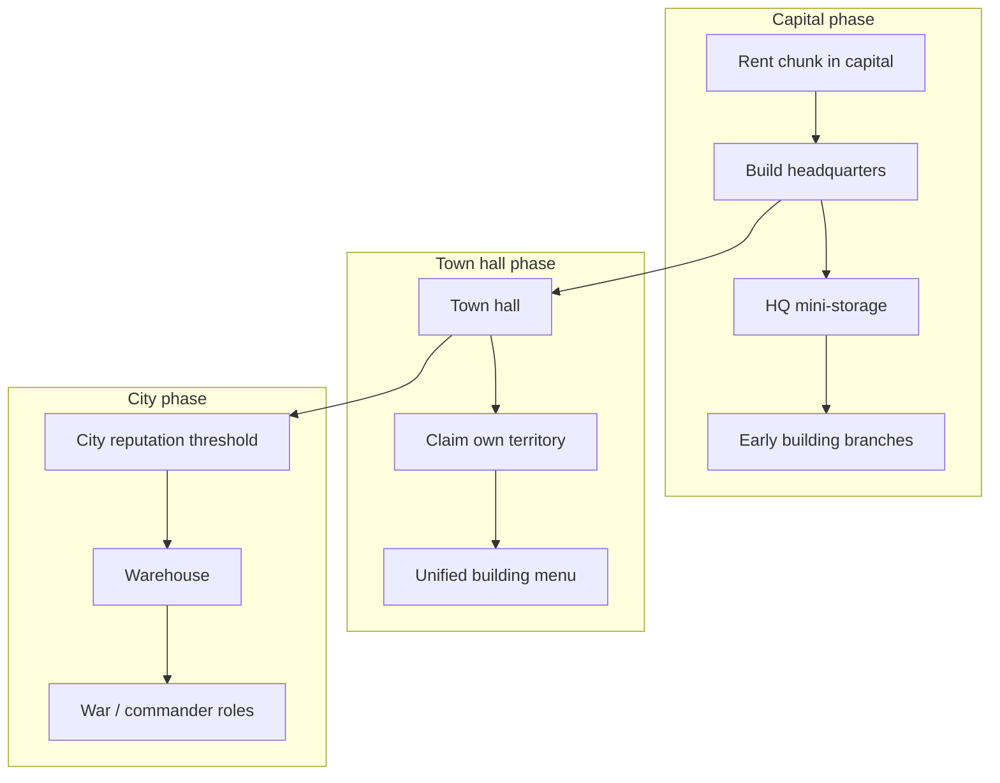

# TM2 Architecture

Architecture showcase for a **modular multiplayer software platform**.

> This repository contains **design documentation and diagrams only**.  
> It does **not** include source code.

TM2 is a large domain-driven system built on top of a game-server runtime (Paper). The runtime is a platform for real-time simulation; the engineering problem is designing a maintainable multiplayer system with progression, economy, territory, production, and combat subsystems.

## Why this repository exists

Interviewers and collaborators should be able to evaluate:

- how the system is decomposed into modules
- how layers separate commands, services, persistence
- how progression and economy rules are modeled
- how testing is approached for domain logic

…without requiring access to a private codebase.

## System context (C4 — Level 1)



## Container view (C4 — Level 2)



## Architectural style

TM2 follows a **layered, modular** style:

```
Command / Listener  →  Service  →  Repository  →  Database
```

Documented testing philosophy mirrors the same layers (unit tests for services and rules; integration tests for pipelines; mocks for Paper API).

### Design principles used

| Principle | How it shows up |
|-----------|-----------------|
| Separation of concerns | Domain packages (`town`, `building`, `economy`, `road`, …) |
| Layering | Commands do not own SQL; services own rules; repos own persistence |
| Config-driven behavior | Building types, production profiles, reputation thresholds in YAML |
| Testability | JUnit 5 + Mockito; pure logic tested without a live server |
| Long-term evolution | Design docs for progression milestones before UI/code growth |

## Domain modules

Top-level packages (illustrative inventory of the private codebase):

| Module | Responsibility |
|--------|----------------|
| `town` | Town lifecycle, effects, tech, cleanup |
| `building` | Placement, upgrades, workers, protection, GUI, schematics |
| `economy` | Currency flows, tax, mint, bonuses |
| `warehouse` | Storage priority and inventory flows |
| `road` | Road construction, zones, protection, visuals |
| `claim` / `rent` | Territory ownership and capital rent |
| `production` / `processing` | Production chains and processing |
| `combat` | Combat policies and resolution |
| `auction` | Auction domain + GUI |
| `db` | Persistence infrastructure |
| `ui` | Action bar / map UI helpers |
| `command` | Command surface (incl. admin) |

## Example domain: team progression

Teams progress through reputation milestones and landmark buildings:



Milestone examples used in design docs:

| Phase | Landmark | Reputation milestone | Unlocks |
|-------|----------|----------------------|---------|
| HQ | `headquarters` | 2 | Early builds, mini-storage |
| Town hall | `town_hall` | 21 | Claims, full team menu |
| City | config threshold | 35 | Warehouse, expanded build set |

Storage priority (design rule):

1. Ready `warehouse` if present  
2. Else headquarters storage chests  
3. Else empty — workers enter a warehouse-empty state  

## Data & infrastructure

- **Language / runtime:** Java 21, Paper API  
- **Persistence:** MySQL + HikariCP  
- **Build:** Maven (shade), JUnit 5, Mockito  
- **Integrations (provided scope):** WorldEdit, PlaceholderAPI, BlueMap API  

## Testing approach

Domain logic is tested independently from the game runtime where possible:

- Unit tests for reputation math, production profiles, combat policies
- Service tests with mocked repositories
- Integration-style tests for production / worker pipelines
- Explicit non-goals: do not re-test Paper internals or JDBC drivers

See also: [docs/testing-approach.md](docs/testing-approach.md)

## What is intentionally not here

- Source code
- Production configs with secrets
- Binary artifacts / schematics dumps
- Server IPs, credentials, or player data

## Related public repositories

- [TeamPlayPlugin](https://github.com/legendery7/TeamPlayPlugin) — earlier team-mechanics module
- [corecraft](https://github.com/legendery7/corecraft) — product website
- [ITPPR](https://github.com/legendery7/ITPPR) — competency assessment web system

## License

Documentation © Mikhail Alekseev. All rights reserved.  
Diagrams and text may be referenced with attribution; the private platform implementation is not open source.
