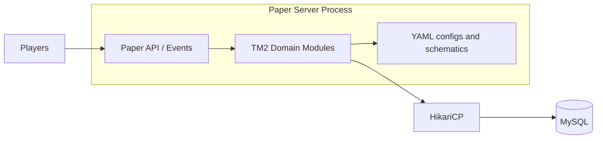

# C4 Container

Container view of a typical TM2 deployment.

## Containers

| Container | Responsibility |
|-----------|----------------|
| Paper process | Hosts networking, worlds, scheduling, plugin lifecycle |
| TM2 modules | Domain logic: towns, buildings, economy, combat, … |
| Config / schematics | Content and structural definitions |
| HikariCP + MySQL | Pooled persistence for durable state |

TM2 is loaded as a modular plugin into the Paper process. Persistence is externalized so server restarts do not discard progression state.
