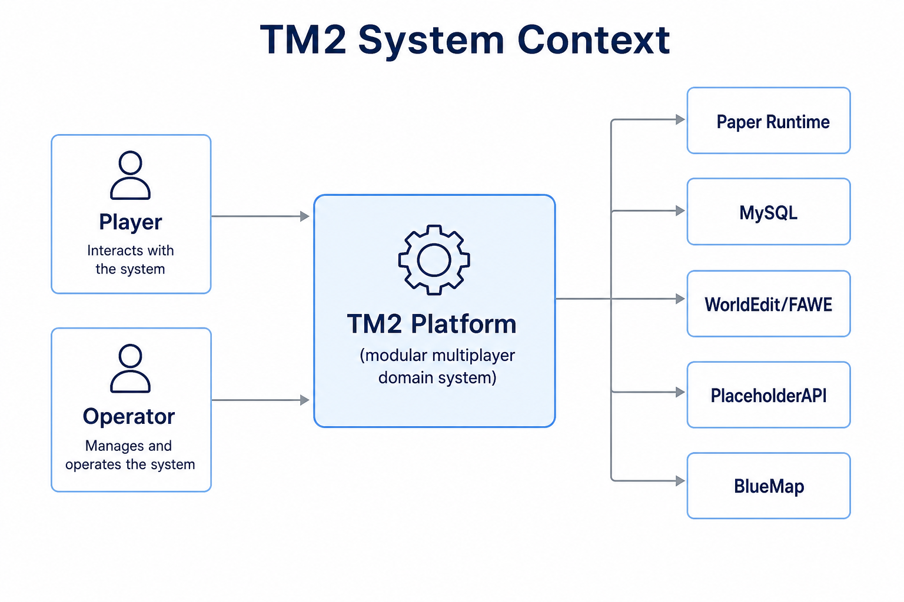
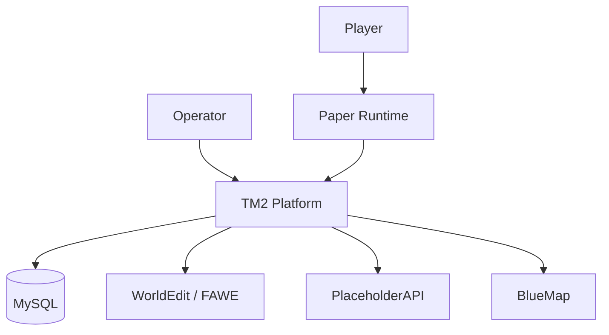

# C4 Context

System context for TM2.

## Actors

| Actor | Intent |
|-------|--------|
| Player | Participates in multiplayer sessions, builds, progresses with a team |
| Operator | Configures rules, moderates, operates the deployment |

## External systems

| System | Role |
|--------|------|
| Paper Runtime | Real-time simulation and networking host |
| MySQL | Primary persistent store |
| WorldEdit / FAWE | Schematic and structural world operations |
| PlaceholderAPI | Text placeholders for UI/integrations |
| BlueMap | Optional map visualization |
