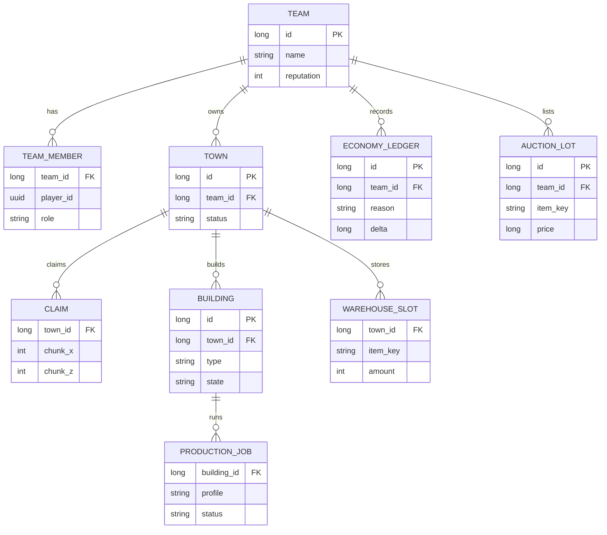

# ER Overview

Logical persistence sketch (not a full vendor schema dump). Names illustrate ownership boundaries.

## Notes

- Reputation and milestone buildings drive unlocks (HQ → town hall → city).
- Storage access follows priority: city warehouse if ready, else HQ mini-storage.
- Exact table names and columns evolve; this diagram communicates **relationships**, not a frozen DDL.
