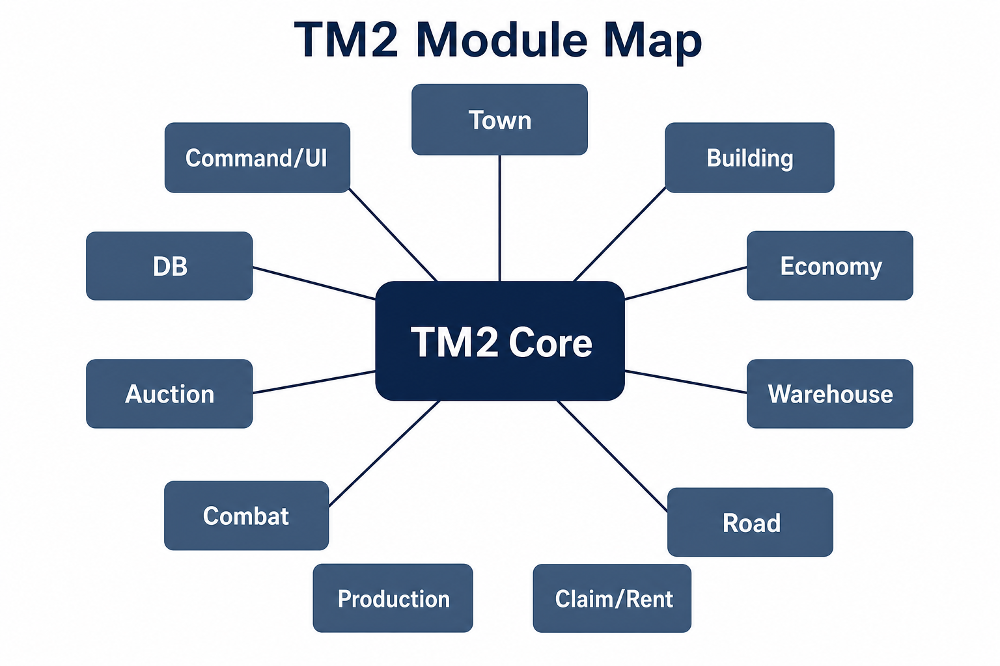

# Module Map

## Top-level domains

| Module | Responsibility |
|--------|----------------|
| `town` | Town lifecycle, effects, tech, cleanup |
| `building` | Placement, upgrades, workers, protection, GUI, schematics |
| `economy` | Currency flows, tax, mint, bonuses |
| `warehouse` | Storage priority and inventory access |
| `road` | Road network, zones, protection, visuals |
| `claim` / `rent` | Territory ownership and capital rent |
| `production` / `processing` | Production chains and processing |
| `combat` | Combat policies and resolution |
| `auction` | Auction model, commands, GUI |
| `db` | Persistence infrastructure |
| `command` / `ui` | Command surface and presentation helpers |

## Building subsystem depth

`building` is intentionally deep (placement, preview, workers, siege hooks, FAWE integration, per-building types). Complexity is isolated in packages rather than flattened into one utility layer.

See also: [modules.md](modules.md)
