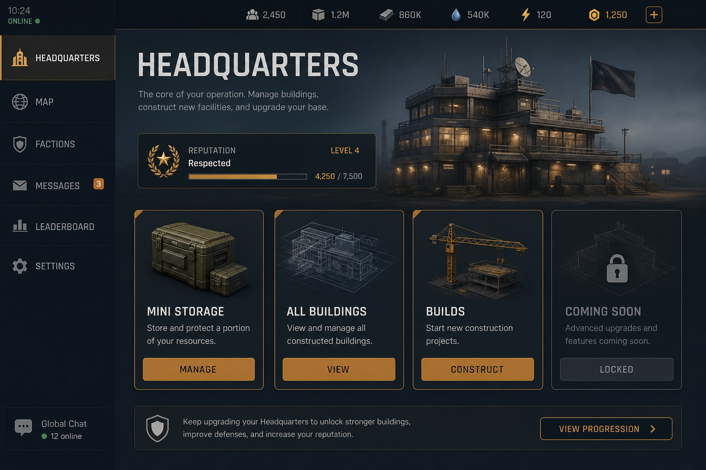
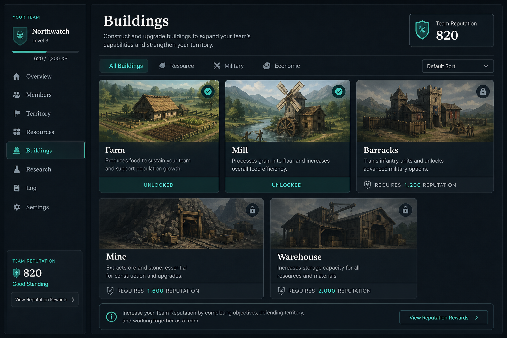

# UI Concepts

Illustrative mockups for interview and design discussion.  
**These are concepts, not production screenshots.**

## Headquarters menu (concept)

Intent: show reputation progress, mini-storage entry, and navigation to builds / full menu.

## Building catalog (concept)

Intent: reputation-gated building cards (farm, mill, barracks, mine, warehouse) with clear lock/unlock states.

## Production note

Real UI screenshots can replace these concepts later without publishing source code. Prefer short clips or stills that show progression, storage, and building placement flows.
